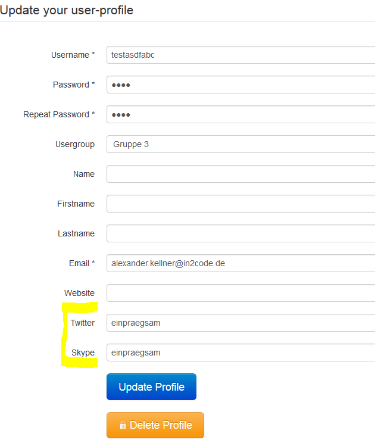
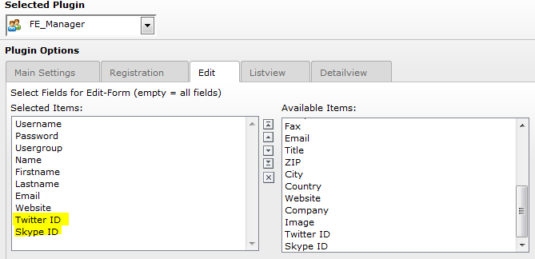

.. include:: ../../Includes.rst.txt

.. _newfields:

Adding new fields to fe_users with your own extension
-----------------------------------------------------

Picture
^^^^^^^

Add new Fields to the Registration-/Editform

Basics
^^^^^^

- Create a new extension for the new fields
- Create ext_tables.sql and Configuration/TCA/Overrides/fe_users.php for adding one or more new fields to fe_users
- Add TSConfig file to add one or more fields to the field selection in femanager flexform and include it
- Use TypoScript to add your own partials folder and add the templates for your new fields
- Create your own user model with getter/setter for your new fields that extends the user model from femanager
- Override the user model in your ext_localconf.php

See https://github.com/in2code-de/femanagerextended for an example extension how to extend femanager with new fields
and validation methods

Step by Step
^^^^^^^^^^^^

Add new fields to the flexform
""""""""""""""""""""""""""""""

Extend Fieldselection in Flexform

Add some Page-TSConfig to extend the selection:

.. code-block:: typoscript

   tx_femanager {
      flexForm {
         new {
            addFieldOptions {
               twitterId = Twitter ID
               skypeId = Skype ID
               somethingElse = LLL:EXT:yourextension/Resources/Private/Language/locallang_be.xlf:custom
            }
         }
         edit < tx_femanager.flexForm.new
      }
   }

Modify the partial folder
"""""""""""""""""""""""""

“twitterId” (see TSConfig) means that femanager searches for a partial TwitterId.html to render the field in the form. So you have to copy the folder EXT:femanager/Resources/Private/Partials (e.g.) to fileadmin/Partials and set the new partial path via TypoScript Constants (see exmple below). In addition you have to add the new Partials files.

.. code-block:: typoscript

   plugin.tx_femanager.view.partialRootPaths.100 = EXT:yourextension/Resources/Private/Partials/

Example file fileadmin/Partials/Fields/TwitterId.html:

.. code-block:: html

   <html xmlns:femanager="http://typo3.org/ns/In2code/Femanager/ViewHelpers" data-namespace-typo3-fluid="true">
	

		<label for="femanager_field_twitterid" class="col-sm-2 control-label">
			<f:translate key="tx_femanagerextended_domain_model_user.twitter_id" extensionName="femanagerextended" />
			<f:if condition="{femanager:Validation.IsRequiredField(fieldName:'twitterId')}">
				*
			</f:if>
		</label>
		

			<femanager:form.textfield
					id="femanager_field_twitterid"
					property="twitterId"
					class="form-control"
					additionalAttributes="{femanager:Validation.FormValidationData(settings:settings,fieldName:'twitterId')}" />
		

	

   </html>

ext_tables.sql
""""""""""""""

Example SQL file in your extension which extends fe_users with your new fields:

.. code-block:: sql

   CREATE TABLE fe_users (
      twitter_id varchar(255) DEFAULT '' NOT NULL,
      skype_id varchar(255) DEFAULT '' NOT NULL
   );

Configuration/TCA/Overrides/fe_users.php
""""""""""""""""""""""""""""""""""""""""

Example Configuration/TCA/Overrides/fe_users.php file:

.. code-block:: php

   $GLOBALS['TCA']['fe_users']['ctrl']['type'] = 'tx_extbase_type';
   $tmpFeUsersColumns = [
      'twitter_id' => [
         'exclude' => 1,
         'label' => 'LLL:EXT:yourextension/Resources/Private/Language/locallang_db.xlf:' .
            'tx_yourextension_domain_model_user.twitter_id',
         'config' => [
            'type' => 'input',
            'size' => 30,
            'eval' => 'trim',
         ],
      ],
      'skype_id' => [
         'exclude' => 1,
         'label' => 'LLL:EXT:yourextension/Resources/Private/Language/locallang_db.xlf:' .
            'tx_yourextension_domain_model_user.skype_id',
         'config' => [
            'type' => 'input',
            'size' => 30,
            'eval' => 'trim',
         ],
      ],
      'tx_extbase_type' => [
         'config' => [
            'type' => 'input',
            'default' => '0',
         ],
      ],
   ];

   \TYPO3\CMS\Core\Utility\ExtensionManagementUtility::addTCAcolumns('fe_users', $tmpFeUsersColumns);
   \TYPO3\CMS\Core\Utility\ExtensionManagementUtility::addToAllTCAtypes('fe_users', 'twitter_id, skype_id');

Own User Model
""""""""""""""

Example Model User.php which extends to the default femanager Model:

.. code-block:: php

   namespace YourVendor\YourExtension\Domain\Model;

   use TYPO3\CMS\Extbase\Domain\Model\Category;
   use TYPO3\CMS\Extbase\Persistence\ObjectStorage;
   use In2code\Femanager\Domain\Model\User as FemanagerUser;

   class User extends FemanagerUser
   {

      /**
       * twitterId
       */
      protected string $twitterId;

      /**
       * skypeId
       */
      protected string $skypeId;

      /**
       * Returns the twitterId
       */
      public function getTwitterId(): string
      {
            return $this->twitterId;
      }

      /**
       * Sets the twitterId
       */
      public function setTwitterId(string $twitterId): void
      {
            $this->twitterId = $twitterId;
      }

      /**
       * Returns the skypeId
       */
      public function getSkypeId(): string
      {
            return $this->skypeId;
      }

      /**
       * Sets the skypeId
       */
      public function setSkypeId(string $skypeId): void
      {
            $this->skypeId = $skypeId;
      }
   }

Include model with TYPO3 12.4.x
"""""""""""""""""""""""""""""""""""""""""""""""""""

Configuration/Extbase/Persistence/Classes.php:

.. code-block:: php

   return [
       \YourVendor\YourExtension\Domain\Model\User::class => [
           'tableName' => 'fe_users',
           'recordType' => 0,
       ],
   ];

ext_localconf.php:

.. code-block:: php

   $GLOBALS['TYPO3_CONF_VARS']['SYS']['Objects'][\In2code\Femanager\Domain\Model\User::class] = [
       'className' => \YourVendor\YourExtension\Domain\Model\User::class,
   ];

Include own controllers with TYPO3 12.4.x (with XCLASS)
"""""""""""""""""""""""""""""""""""""""""""""""""""""""

You can override the whole controller with XCLASS. This is not the best solution but it works.
XCLASS Limitations: https://docs.typo3.org/m/typo3/reference-coreapi/main/en-us/ApiOverview/Xclasses/Index.html#xclasses-limitations

ext_localconf.php:

.. code-block:: php

   $GLOBALS['TYPO3_CONF_VARS']['SYS']['Objects'][\In2code\Femanager\Controller\NewController::class] = [
      'className' => \YourVendor\YourExtension\Controller\NewController::class,
   ];

