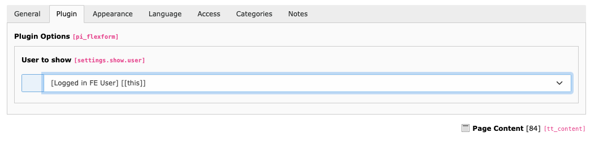
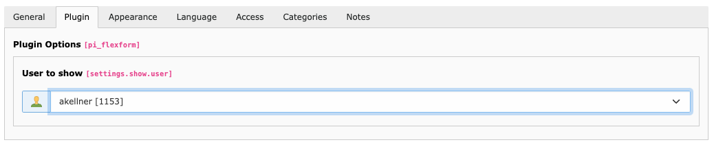
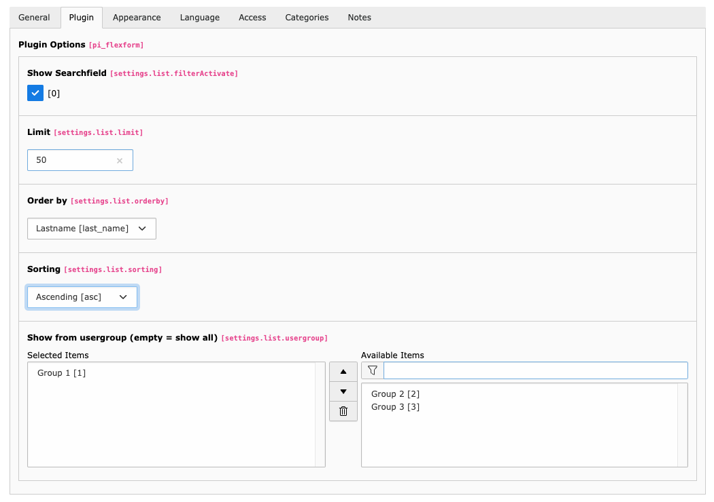

.. include:: ../../Includes.rst.txt

.. _showlistusers:

Show and List Frontend Users
----------------------------

This Feature allows you to display the data of the current user, a selected user by an editor or list users and provide
a detail page.

Caution: Please take care that you do not disclose information in public environments and be careful which data you
show in the detail view.

Show the current user
^^^^^^^^^^^^^^^^^^^^^

Useful, if you want to show a "read only view" for the currently logged in frontend user.

**Configuration:**

#. Add a femanager_detail plugin to your page
#. in the field "User to show" choose "Logged in FE User"

Show a given user
^^^^^^^^^^^^^^^^^

You can provide a detail view of a given frontend user

#. Add a femanager_detail plugin to your page
#. select the user to be shown in the field "User to show"

.. attention::
   Take care that you do not disclose information in public environments and be careful which data you show in the
   detail view.

   If you do not select a frontend user, the detail view only renders a user that was linked from a femanager list
   plugin. Those links carry a signed ``hash`` argument that is validated before the record is rendered, so a
   hand-crafted URL with an arbitrary ``tx_femanager_detail[user]=XX`` and no valid hash is rejected.

Custom list and detail templates
~~~~~~~~~~~~~~~~~~~~~~~~~~~~~~~~

Every link to the ``show`` action that passes a ``user`` must also pass the corresponding signed ``hash``. This
also applies to customized list templates. Without the hash, the detail request is rejected.

``UserController::listAction`` assigns the ``showHashes`` array, keyed by the user uid. Use it in customized list
templates as follows:

.. code-block:: html

   <f:for each="{users}" as="user">
      <f:variable name="showHash" value="{showHashes.{user.uid}}" />
      <f:link.action action="show" arguments="{user:user, hash:showHash}">
         {user.username}
      </f:link.action>
   </f:for>

In a customized detail template, use the single ``showHash`` variable for a self-referencing link:

.. code-block:: html

   <f:link.action action="show" arguments="{user:user, hash:showHash}">
      {user.username}
   </f:link.action>

List Users
^^^^^^^^^^^

#. Add a a femanager_list plugin to your page
#. set the plugin options to show the users you want to display

Plugin Options:

*  Show Searchfield: You can provide a searchfield, to filter the users
*  Limit: Define how many users are listed per page
*  Order by: Choose which field should be used to order the list
*  Sorting: Define sort ordering
*  Show from usergroup (empty = show all): Select one or more usergroups. If you don't select a group, all frontend users are displayed
